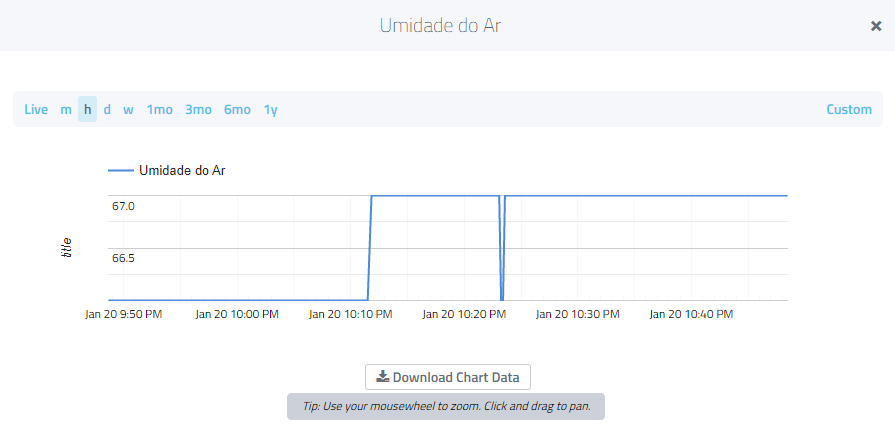

# IBO - I'LL BE OKAY

> This repository contains a collection of assignments completed for the *System Identification and Parameter Estimation* (TIP7044) course at the Federal University of Ceará during my Master's degree. 

## Application Description 💻

Development of an IoT-based crop management tool enabling efficient remote planting control. Utilizing pumps and solenoids as actuators, and temperature and humidity sensors. A Raspberry Pi serves as a data aggregation hub and remote command executor. Features include easy analysis and visualization of the greenhouse conditions, monitoring and notifications about the plant's status, as well as alerts in case of malfunctions.


## System Description 📄

### Application Requirements 
- Data Collection
- Sensor Monitoring
- Actuator Control
- Alarm Configuration

### Functional Requirements 

| ID  | Functional Requirements | Description                                         |
|-----|-------------------------|-----------------------------------------------------|
| RF1 | Humidity Sensor         | The system must read the air humidity.              |
| RF2 | Soil Moisture Sensor    | The system must read the soil moisture.             |
| RF3 | Temperature Sensor      | The system must read the ambient temperature.       |
| RF4 | Water Actuator          | The system must act to ensure water supply.         |
| RF5 | Application             | The user will be able to consult the values of all sensors in the system. |

### Non-Functional Requirements 

| ID   | Non-Functional Requirements | Description                                                                                                 |
|------|-----------------------------|-------------------------------------------------------------------------------------------------------------|
| RNF1 | Speed                       | The speed of environment evaluation and correction should be processed every second to ensure stability.    |
| RNF2 | Ease of Use                 | The visualization of the greenhouse state should be concise.                                                |
| RNF3 | Robustness                  | In case of failure, the system should be able to restart itself and correct errors, or halt operations and alert the user if it cannot. |

### System Architecture Description


## Materials

For the project in question, two sensors were used: **DHT11** and a **Capacitive Soil Moisture Sensor Module**.

- **DHT11** - Sensor used to measure air temperature and humidity. It has an accuracy of +- 2°C and +- 5.0%. Furthermore, it is a sensor recommended for systems where temperature and humidity variations are, respectively, in the ranges of 0 to 50°C and 20 to 90%.
 
  
  
- **Capacitive Soil Moisture Sensor Module** - As the name suggests, the sensor is used to measure soil moisture variation. It offers a longer lifespan and resistance to corrosion compared to resistive models.

  
  
To perform the collection, processing, and storage (per hour) of information, the chosen embedded system was the **Raspberry Pi 4 Model B**. The Raspbian operating system (Linux-based) was chosen and installed on the device.


It is important to note that one of the sensors used, specifically the one that measures soil moisture, produces an analog output signal. However, the Raspberry does not have analog ports. Thus, the **MCP3008** was used, which is an 8-channel A/D converter. It has a 10-bit resolution and uses the SPI protocol to communicate with the microcomputer.


Python was the programming language adopted for the implementation of the sensor configuration and reading codes. The codes are executed directly by the Raspberry terminal.

Initially, a code for the calibration of the capacitive sensor was implemented. Then, a single code was used to read both the air humidity and temperature sensors and the soil moisture sensor.


The IoT platform chosen for the development of the project in question was Cayenne. MQTT was the communication protocol used to establish the connection for sending information from the device to the platform server.


Initially, for the code development that establishes communication between the device and the platform, the **paho.mqtt.client** library was used. The information taken from the platform to set up the connection were:

- user: db5a8060-3e2b-11ec-8da3-474359af83d7
- password: f56e60c61d27ffb784d9a78e776c19e695314deb
- client_id: 8a3d3e70-7a4e-11ec-a681-73c9540e1265 (**changes from device to device**)
- server: mqtt.mydevices.com
- port: 1883

It was necessary to implement the following command lines to connect the device to the platform:
```
client = mqtt.Client(client_id) # Instance that will connect with MyDevices
client.username_pw_set(user,password) # Requirements for connection
client.connect(server,port) # Establishes the connection
```
After establishing the connection between the Raspberry and the platform, the necessary configurations were made to enable the sending of information to the server. Widgets were created for the dashboard by configuring through which channels the data would be sent (Figure 15). And with that, a command was implemented for each sensor with the following structure:
```
client.publish('v1/username/things/clientID/data/channel', variable_name)
```


## Results





## License 📄

This project is licensed under the MIT License - see the [LICENSE.md](LICENSE.md) file for details.

## Contact 📬

If you have any questions or suggestions about the project, please feel free to reach out:

- **LinkedIn**: [My LinkedIn Profile]([https://www.linkedin.com/in/your-profile/](https://www.linkedin.com/in/andreza-nascimento-ce/))
- **Email**: `andrezacosta@alu.ufc.br`
